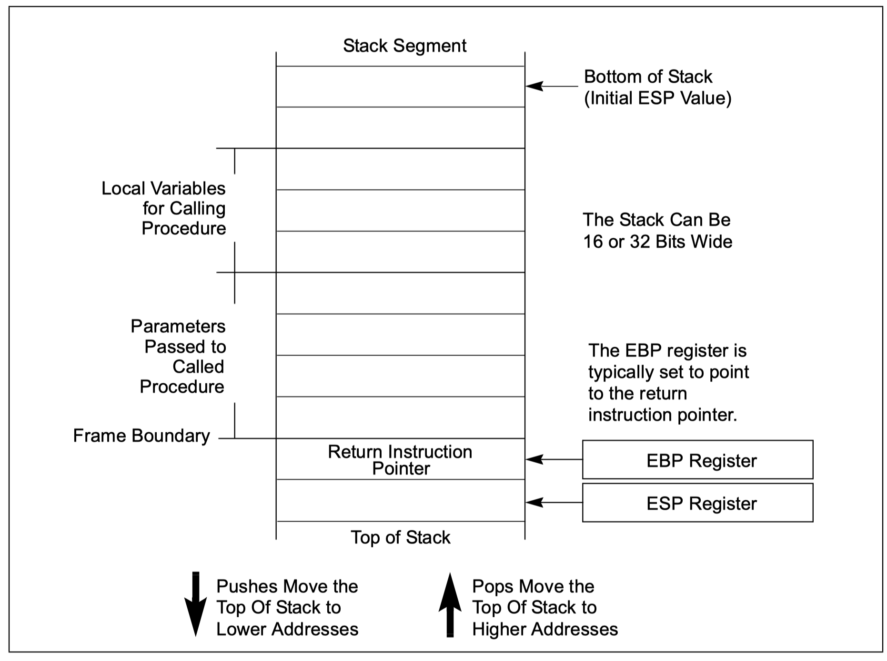
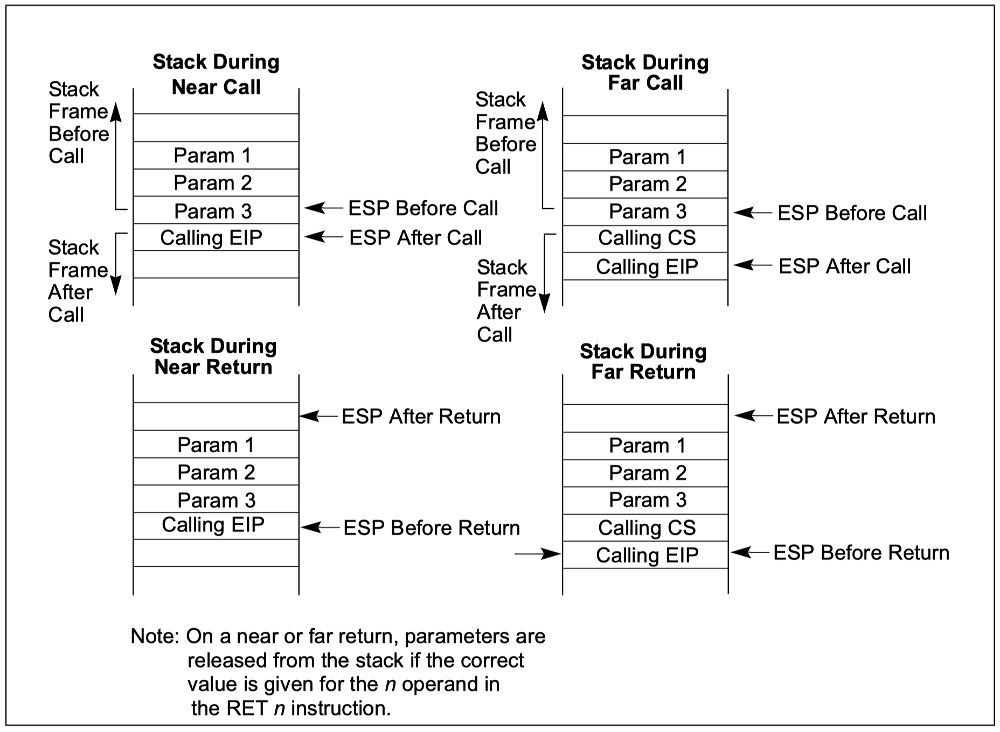
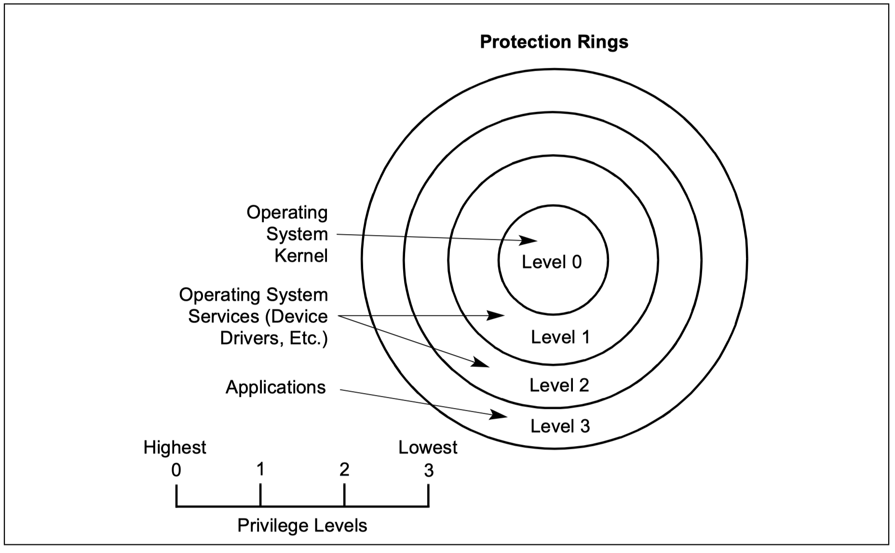
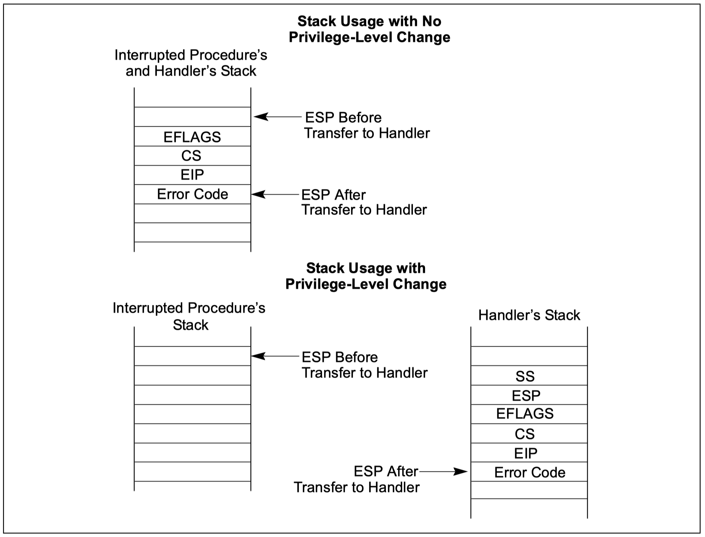

# 过程调用、中断和异常

>   `《手册》第一卷 Chapter 6`

## 1. 两种过程调用类型

+   CALL & RET 指令
+   ENTER & LEAVE 指令

两种调用类型都会用到**`栈`**，栈可用来保存调用过程状态，给被调用过程传递参数以及存储本地变量。

IA-32 CPU处理中断和异常时的机制与`CALL&RET`过程类型。

## 2. 栈

### 2.1 栈对齐

栈段描述符中的**`D`**标志位决定了两个对齐值：栈指针SS是按16位还是32位对齐、栈PUSH和POP时ESP是按2字节递减/增还是按4字节递减/增。将16位值push到32位对齐的栈中可能会导致栈指针对齐错误，所以通常情况下将16位值push到32位对齐栈时，会自动将16位值扩展到32位后再push。

## 3. CALL & RET

### 3.1 NEAR CALL & RET

+   NEAR CALL
    +   EIP压栈
    +   将被调用过程的偏移量加载到EIP
    +   执行被调用过程

+   NEAR RET
    +   弹出栈顶值至EIP
    +   若RET指令有可选的n参数，则将ESP更新为(ESP+n) - 即释放被调用过程的参数空间
    +   返回执行调用过程

### 3.2 FAR CALL & RET

+   FAR CALL
    +   CS压栈
    +   EIP压栈
    +   加载参数中的段选择器至CS段寄存器
    +   加载参数中的被调用过程至EIP
    +   开始执行被调用过程
+   FAR RET
    +   弹出栈顶值至EIP
    +   弹出栈顶值至CS
    +   释放`RET`后跟的可选n参数指定的字节数 - ESP = ESP + n
    +   返回执行调用过程

### 3.3 参数传递

参数传递方式有三种: `通用寄存器`、`参数列表`、`通过栈`

#### 3.3.1 通用寄存器传递参数

CPU在过程调用过程中不会保存通用寄存器状态，过程调用中可以使用通用寄存器传递至多6个参数（除ESP和EBP之外的其它通用寄存器）。**`被调用过程在返回时也可以使用同样的方式将参数传递给调用过程`**。

#### 3.3.2 使用栈传递参数

**`这种方式也同样可以用于被调用过程将参数传递给调用过程`**

#### 3.3.3 使用参数列表

**`可以将参数存放在某个数据段指向的内存空间中`**

### 3.4 保存过程状态

CPU在过程调用过程中不会自动保存通用寄存器、段寄存器、EFLAGS标志寄存器等的状态。调用过程应该显式保存在被调用过程返回后可能被用到的寄存器状态，可以将这些寄存器数据暂存在栈上或者某个数据段指定的内存空间中。

+   `PUSHA`&`POPA`

    >   `PUSHA`会按如下顺序将寄存器值压栈：`EAX`、`ECX`、`EDX`、`EBX`、`ESP(调用PUSHA之间的ESP值)`、`EBP`、`ESI`、`EDI`。`POPA`则是会逆序弹出值。

+   `PUSHF/PUSHFD`&`POPF/POPFD`

    >   用来保存`EFLAGS`标志状态器的状态。`PUSHF`会将`EFLAGS`低16位压栈，`PUSHFD`则将将整个32位`EFLAGS`压栈

### 3.5 Calls to Other Privilege Levels

#### 3.5.1 调用门

低权限代码不能直接调用高权限代码，只能通过**`调用门`**。**`调用门描述符结构类似段描述符，CPU对调用门的处理类似通过段描述符进行CALL FAR调用`**，但有如下不同：

+   *`调用门描述符与段描述符的区别`*
    +   包含访问权限信息
    +   包含被调用过程的代码段选择符
    +   包含被调用过程在指定代码段中的偏移
+   CPU会切换到另一个栈中执行被调用过程，**CPU对每个`privilege level`都要求有一个对应的栈**，默认情况下SS和ESP寄存器存储`privilege level 3`对应的栈信息，而对于`privilege level 2、1、0`对应的栈寄存器和栈顶指针寄存器则存储在一个系统段中，叫做**`the task state segment(即TSS)`**

### 3.6 CALL and RET Operation Between Privilege Levels

代码调用高优先级代码时:

+   先执行访问权限检查
+   暂存当前的SS、ESP、CS和EIP寄存器内容
+   从**`TSS`**中加载被调用过程所处`privilege level`对应的新栈的段选择器和栈顶指针
+   将调用过程暂存的SS和ESP寄存器内容push到新栈栈顶
+   将被调用过程需要的参数从调用过程的栈中复制过来（**`调用门描述中专门有一个字段用来标识被调用过程需要几个参数`**）
+   将调用过程暂存的CS和EIP寄存器内容push到新栈栈顶
+   从**`调用门描述符中加载被调用过程的段选择器和段偏移至CS和EIP寄存器`**
+   在当前`high privilege level`开始执行

从高优先级代码返回时:

+   Performs a privilege check.

+   Restores the CS and EIP registers to their values prior to the call.

+   (If the RET instruction has an optional n argument.) Increments the stack pointer by the number of bytes specified with the n operand to release parameters from the stack. If the call gate descriptor specifies that one or more parameters be copied from one stack to the other, a RET n instruction must be used to release the parameters from both stacks. Here, the n operand specifies the number of bytes occupied on each stack by the parameters. On a return, the processor increments ESP by n for each stack to step over (effectively remove) these parameters from the stacks.

+   Restores the SS and ESP registers to their values prior to the call, which causes a switch back to the stack of the calling procedure.

+   (If the RET instruction has an optional n argument.) Increments the stack pointer by the number of bytes specified with the n operand to release parameters from the stack (see explanation in step 3).

+   Resumes execution of the calling procedure.

## 4. 中断和异常

+   中断通常是由I/O设备产生的异步事件
+   异常是在处理器执行过程中对特定令产生的同步事件，IA-32架构定义了三种异常: faults、traps、aborts

IA-32 CPU对中断和异常采用相同的处理方式，当中断或异常产生时，CPU停止当前程序，切换到专门的程序执行处理逻辑。这些专门的程序入口存储在**`interupt descriptor table(IDT)`**中，当程序处理完成之后，CPU再切换回原程序继续执行。

IA-32预定义了17个中断/异常号对应的处理程序，用户可自定义224个，程序入口全部存储在**`IDT`**中。此外CPU中还定义了几个入口不存储在IDT当中的中断号，例如SMI中断。

### 4.1 Call and Return Operation for Interrupt or Exception Handling Procedures

调用中断/异常处理过程类似使用**`调用门`**调用`high privilege level`过程，在这里叫做**`interrupt gate`**或**`trap gate`**。

**`interrupte gate/trap gate`**类似**`call gate`**，也提供以下信息:

+   Access rights information
+   中断/异常处理过程对应的段选择子
+   中断/异常处理过程入口对应的代码段中的偏移

**注：`interrupt gate`和`trap gate`的区别是**

>   当处理器通过`interrpte gate`处理中断/异常，会清除`EFLAGS`寄存器中的**`IF`**位，以阻止在执行中断/异常处理程序过程中再产生中断/异常。而`trap gate`则不会清除**`IF`**位。

此外，**如果中断/异常处理程序代码段`privilege level`和当前`privilege level`相同，则中断/异常处理程序会直接使用当前的栈。如果中断/异常处理程序代码段`privilege level`和当前`privilege levle`不同，则会切换到该`privilege level`所对应的栈**。

#### 4.1.1 不需要切换栈时中断/异常处理程序执行步骤

+   将**`EFLAGS`**、**`CS`**、**`EIP`**按序压栈
+   将**`error code`**压栈
+   将中断处理程序代码段选择子和入口偏移（从`interrupt gate`或`trap gate`中取得）加载至CS和EIP寄存器中
+   如果是通过`interrupt gate`调用处理程序，清除`EFLAGS`寄存器的**`IF`**标志
+   开始执行处理程序
+   **`处理程序执行完成后再出栈信息，回到原来的程序`**

#### 4.1.2 需要切换栈时的中断/异常处理程序执行步骤

+   暂存**`SS`**、**`ESP`**、**`EFLAGS`**、**`CS`**、**`EIP`**寄存器内容（不是压到栈中，是暂存）
+   从**`TSS`**中找到中断/异常处理程序`privilege level`对应的栈信息，加载到**`SS`**和**`ESP`**，即切换到新栈
+   将**`SS`**、**`ESP`**、**`EFLAGS`**、**`CS`**、**`EIP`**按顺序压栈到新栈
+   将**`error code`**压入新栈
+   将中断处理程序代码段选择子和入口偏移（从`interrupt gate`或`trap gate`中取得）加载至CS和EIP寄存器中
+   如果是通过`interrupt gate`调用处理程序，清除`EFLAGS`寄存器的**`IF`**标志
+   开始执行处理程序
+   **`处理程序执行完成后再切回到原栈，切回到原代码程序继续执行`**

#### 4.1.3 图示

### 4.2 Calls to Interrupt or Exception Handler Tasks

跟4.1差不多，只是通过一个叫做**`task gate descriptor`**的东西

### 4.3  实模式下的中断/异常处理

### 4.4 INT n, INTO, INT 3, and BOUND Instructions

**`INT n`**、**`INTO`**、**`INT 3`**和**`BOUND`**指令使程序可以显式调用中断/异常处理程序。

+   **`INT n`**：程序可以通过改变参数n来调用任何中断/异常处理程序
+   **`INTO`**：在`EFLAGS`寄存器中`OF`标志置位时，显式调用overflow exception处理程序
+   **`INT 3`**：显式调用断点异常，用于调试时使用
+   **`BOUND`**：显式调用`BOUND-range exceeded exception`处理程序

## 5. PROCEDURE CALLS FOR BLOCK-STRUCTURED LANGUAGES

主要就是**`ENTER`**和**`LEAVE`**