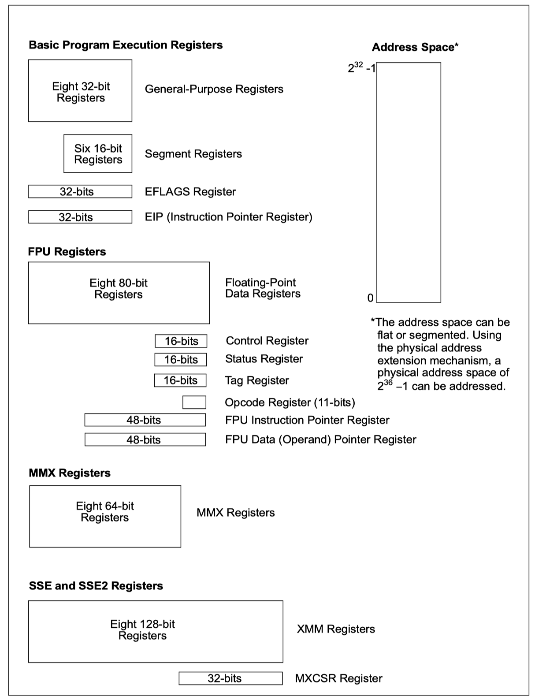
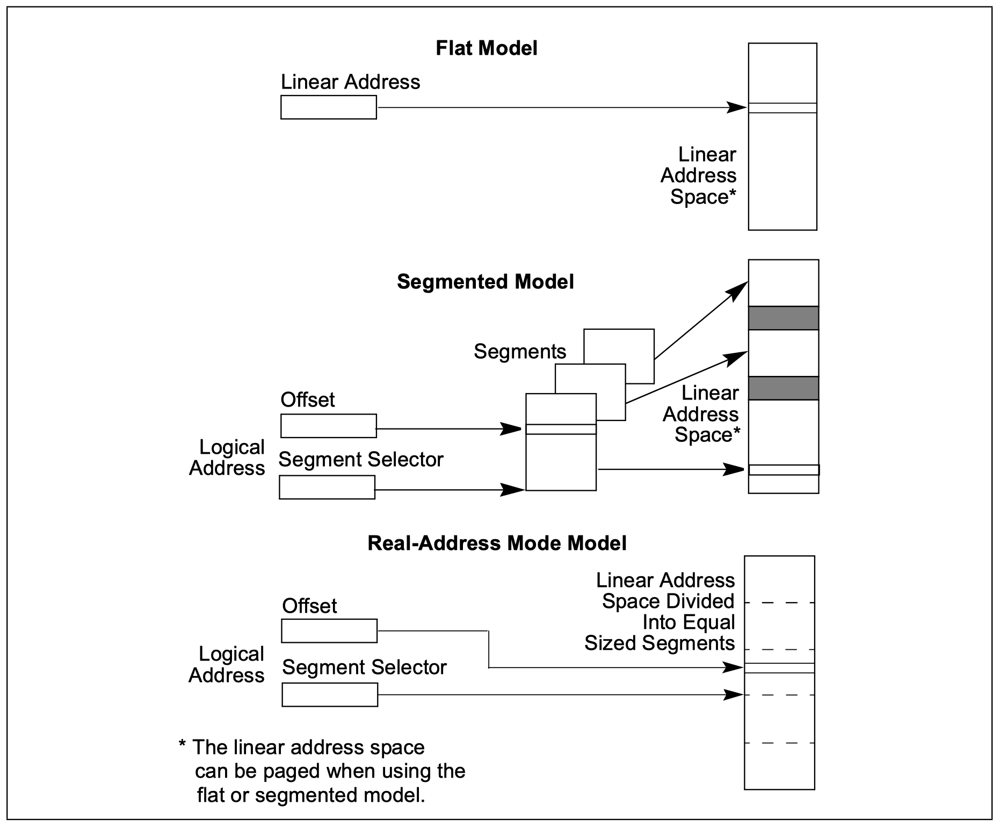
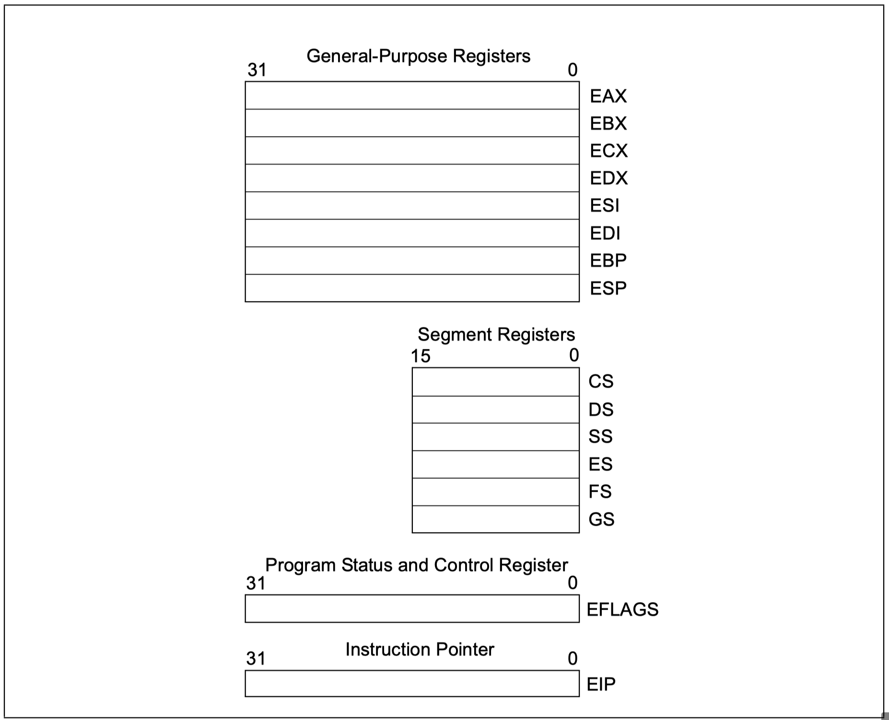
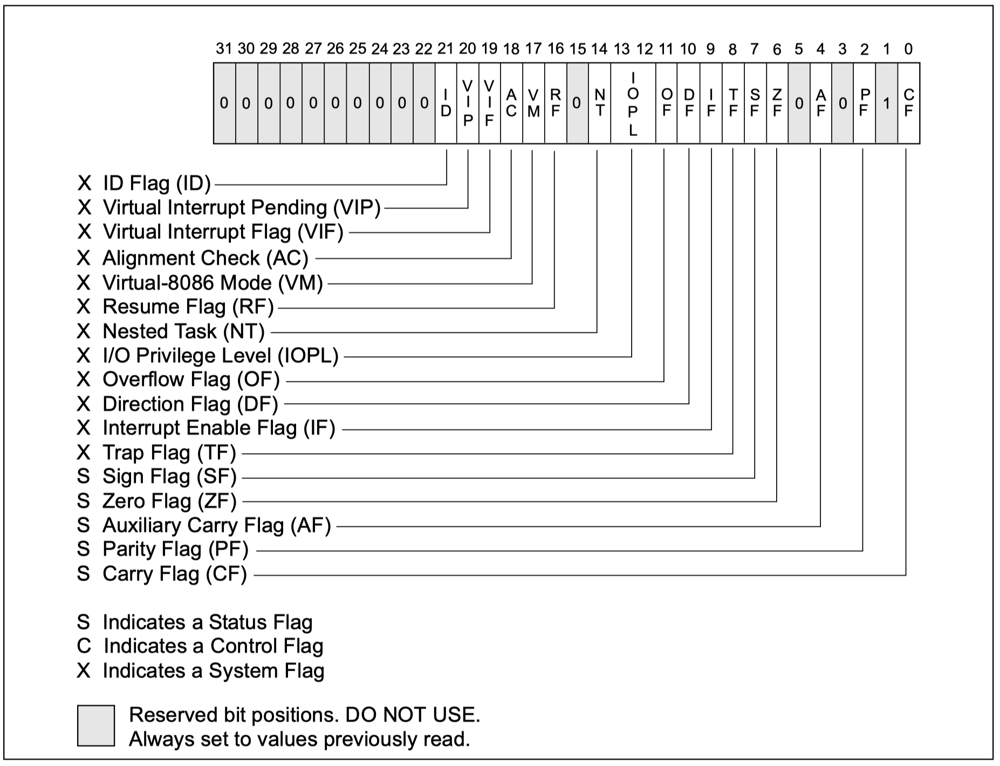

# BASIC EXECUTION ENVIRONMENT

## 1. 执行模式

`IA-32`架构支持三种执行模式：

+   **`保护模式`**
+   **`实模式`**
+   **`系统管理模式（System management mode）-SSM`**

## 2. 程序执行环境

### 2.1 基本执行环境

+   **`Address Space`**：运行在IA-32之上的程序，可以至多寻址32GB虚拟内存以及至多64GB物理内存（在打开`Extended Physical Addressing`的情况下）
+   **`Basic program execution registers`**：8个通用寄存器、6个段寄存器、EFLAGS寄存器、EIP指令寄存器
+   **`x87 FPU registers`**：8个
+   **`MMX registers`**：8个`MMX`寄存器，用于支持对64位数据的SIMD(single-instruction, multiplele-data)操作
+   **`XMM registers`**：8个`XMM`寄存器，用于支持用128位数据的SIMD操作
+   **`Stack`**

### 2.2 IA-32额外系统资源

>   *`IA-32`*除了上面的基础执行环境外，还提供了额外的系统资源，用于支持操作系统以及软件开发的特定功能。

+   **`I/O ports`**
+   **`Control registers`**：5个控制寄存器，**cr0~cr5**，用于控制CPU的执行模式以及当前执行任务的特性数据
+   **`Memory management registers`**：`GDTR`、`IDTR`、`task register`、`LDTR`用于指定保护模式下的相关数据结构在内存中的位置
+   **`Debug registers`**：`DR0`~`DR7`
+   **`Memory type range registers（MTRRs）`**
+   **`Machine specific registers（MSRs）`**：用于控制以及报告当前CPU性能数据的寄存器，通常情况下`MSR`寄存器处理系统相关函数，且不能从应用程序中访问
+   **`Machine check registers`**
+   **`Performance monitoring counters`**

### 2.3 执行环境总结

## 3. 内存访问模型

`IA-32`支持三种内存访问模型：`flat`、`segmented`、`real-address mode`。

+   **`flat mode`**：地址就是物理地址
+   **`segmented mode`**：分段访问，不开启分页的情况下，获取到的就是物理地址
+   **`real-address mode`**：在开启分页的情况下，分段获取到的地址需要经过页表才获取到物理地址

### 3.1 执行模式vs内存访问模型

+   **`保护模式`**：在`保护模式`下可以使用上面提到的所有三种内存访问模型
+   **`实模式`**：在`实模式`下只支持`real-address model`
+   **`System Management Mode`**：在`SMM`模式下，处理器会切换到一块单独的地址空间，叫做`System management RAM`（SMRAM）。在这块地址空间的内存访问模型类似`real-address model`。

## 4. Basic program execution registers

+   **`通用寄存器`**
+   **`段寄存器`**
+   **`EFLAGS（program status and control）寄存器`**
+   **`EIP`**

### 4.1 ELFAGS寄存器

#### 4.1.1 状态标志

+   **`CF(bit 0)`**：进位标志，标识无符号整数计算时最高位是否有进位/借位
+   **`PF(bit 2)`**：奇偶标志，计算结果的LSB是否包含偶数个1
+   **`AF(bit 4)`**：`Adjust Flag`，用于BCD运算
+   **`ZF(bit 6)`**
+   **`SF(bit 7)`**：符号标志，等于有符号整数计算结果的最高位的值
+   **`OF(bit 11)`**：溢出标志，标识有符号整数计算溢出情况

#### 4.1.2 DF标志

方向标志位

#### 4.1.3 System flags and IOPL field

+   **`IF(bit 9)`**：中断允许标志
+   **`TF(bit 8)`**：Trap flag
+   **`IOPL(bit 12 and 13)`**：`I/O privilege level field`，标识当前任务的I/O优先级，只有当前任务的`IOPL`小于或等于要访问的I/O地址空间的优先级时，才允许任务访问。
+   **`NT(bit 14)`**：`Nested task flag`
+   **`RF(bit 16)`**：Resume flag
+   **`VM(bit 17)`**：virtual-8086 mode flag
+   **`AC`**
+   **`VIF`**
+   **`VIP`**
+   **`ID`**

## 5. operand-size and address-size attributes