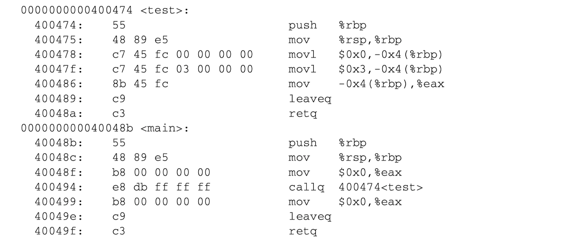
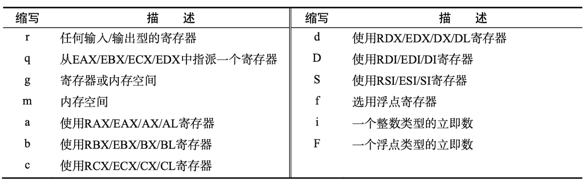

# 汇编语言整体说明

>   摘自《一个64位操作系统的设计与实现》

汇编语言的书写格式大体分为两种，一种是AT&T汇编语言格式，另一种是Intel汇编语言格式。这两种书写格式并不会影响汇编指令的功能，而且它们都有相应的编译器支持。

Intel汇编语言格式书写简洁，使用起来会比较舒服，支持它的编译器有MASM编译器、NASM编译器和YASM编译器。而AT&T汇编语言格式相对来说会复杂一些，支持它的编译器是GNU的GAS编译器。

对本书（即`《一个64位操作系统的设计与实现》`）而言，BootLoader部分将采用Intel格式的汇编语言编写，使用NASM编译器进行编译；操作系统的内核与应用程序将采用AT&T格式的汇编语言编写，使用GNU的GAS编译器进行编译。同时使用这两种汇编语言书写格式是有原因的，可以概括为以下两点：

+   由于BootLoader全部使用汇编语言编写，代码量大，如果采用Intel格式的汇编语言，可以保证既书写简单又便于阅读。
+   内核与应用程序只有一小部分关键代码必须使用汇编语言编写，绝大部分代码会使用GNU C语言编写，那么为GNU C语言搭配上AT&T格式的GNU汇编语言，可使两者更加自然流畅地相互调用，进而提高两者的互相兼容性。


## 1. AT&T汇编语言格式与Intel汇编语言格式

|                  | Intel汇编语言                                                | AT&T汇编语言                                                 |
| ---------------- | ------------------------------------------------------------ | ------------------------------------------------------------ |
| 书写格式         | 大多数编译器要求关键字必须使用大写字母书写，如:<br />MOV AX, 0x10 | 编译器要求关键字必须使用小写字母书写，如:<br />mov $0x10, %ax |
| 赋值方向         | 指令通常带有两个操作数，一个是目的操作数，另一个是源操作数，赋值方向从右向左。 | 第一个是源操作数，第二个是目的操作数，赋值方向从左向右。     |
| 操作数前缀       | 使用寄存器和立即数无需额外添加前缀。例如: <br />MOV CX, 12   | 使用寄存器必须在前面添加指令前缀%，使用立即数必须在前面添加前缀$，例如:<br />mov $12, %cx<br />对于标识符变量，可以直接引用，无需添加前缀。例如: <br />values: .long 0x5a5a5a5a<br />movl values, %eax<br />此处的values是一个标识符变量，这条指令的意思是将values变量记录的数值装入寄存器eax中。<br />如果添加标识符前缀$，则说明正在引用该变量的地址。例如:<br />movl $vales, %ebx<br />这条汇编指令的意思是将values变量的地址装入ebx寄存器 |
| 跳转和调用指令   | 远跳转指令JMP的目标地址由段地址和段内偏移组成。远调用指令CALL的目标地址同样由段地址和段内偏移组成，远返回指令RET无操作数:<br />CALL FAR SECTION:OFFSET<br />JMP FAR SECTION:OFFSET<br />RET | 对于远跳转指令和远调用指令必须使用前缀`l`加以修饰，与`lcall`指令相对应的是远返回指令`lret`。例如:<br />lcall $section:$offset<br />ljmp $section:$offset<br />lret |
| 内存间接寻址格式 | Intel使用[]来表示间接寻址，完成格式为<br />section:[base+index*scale+displacement]<br />其中scale的默认值为1，可取值是1、2、4、8<br />section用于指定段寄存器，不同情况的默认段寄存器是不同的 | 使用()来表示间接寻址，格式为<br />setion:displacement(base, index,scale)<br />这里的section, base, index, scale, displacement与Intel的使用规则相同 |
| 指令的后缀       | 使用内存操作数时应该对操作数的位宽加以限定，借助修饰符PTR可以限定操作数的位宽，例如:<br />BYTE PTR代表一个字节、WORD PTR代表一个字、DWORD PTR代表一个双字等，例如:<br />MOV EAX, DWORD PTR [EBX] | 大部分指令在访问数据时都需要指明操作数的位宽，通常一个字节用b表示、一个字用w表示、一个双字用l表示、一个四字用q表示。例如:<br />movq %rax, %rbx<br />此外，跳转指令的地址标识符也可添加后缀以表示跳转方向，f表示向前跳转，b表示向后跳转，如:<br />jmp 1f<br />1: |


## 2. NASM编译器

NASM编译器在语法和书写格式上，与MASM编译器比较相似，需要说明以下几点：

+   符号[]

    >   在`NASM`编译器中，如果直接引用变量名或者标识符，则编译器认为正在引用该变量的地址。如果希望访问变量里的数据，则必须使用符号`[]`。可以把它想你成C语言中的数组，数组名代表数组的起始地址，当为数组名加上符号`[]`后，就表示正在引用数组的元素

+   符号$

    >   在`NASM`中符号`$`代表当前行被编译后的地址。例如:
    >
    >   ```assembly
    >   jmp $
    >   ```
    >
    >   这条汇编指令的功能是死循环。

+   符号$$

    >   符号`$$`代表一个Section（节）起始处被编译后的地址，也就是这个节的起始地址。


## 3. 在汇编语言调用C语言的函数

在开发操作系统时，常常会从汇编语言跳转至C语言的函数中去执行。比如，从系统引导程序（汇编语言）跳转到系统内核主函数中，或者从中断处理入口程序（汇编程序）跳转到中断处理函数（属于中断上半部分）中等。这些汇编语言调用C语言的过程都会涉及到函数的调用约定、参数的传递方式、函数的调用方式等技术细节。

### 3.1 函数的调用方式

汇编语言调用函数的方式并不复杂，通过汇编指令JMP、CALL、RET及其变种指令就可以实现。如下这段代码:

```c
int test() {
    int i = 0;
    i = 1 + 2;
    return i;
}

int main() {
    test();
    return 0;
}
```


反汇编这段代码，从汇编语言的角度去看函数test的调用过程。

```shell
objdump -d test
```




#### 3.1.1 JMP指令替代CALL指令

上面**`callq 400474<test>`**可以用下面两条指令替代：

```assembly
pushq $0x0000000000400499
jmpq 400474<test>
```

#### 3.1.2 RET指令替代CALL指令

```assembly
pushq $0x000000000004000499
pushq $0x000000000004000474
retq
```


### 3.2 函数的调用约定

函数的调用约定描述了执行函数时返回地址和参数的出入栈规律。以下是几种比较流行的函数调用约定:

+   stdcall调用约定

    +   在调用函数时，参数将按照从右向左的顺序依次压入栈中，例如下面的function函数，其参数入栈顺序依次是second、first

        ```c
        int function(int first, int second);
        ```

    +   函数的栈平衡操作（参数出栈操作）由`被调用函数`完成。通过代码**`retn x`**可在函数返回时从栈中弹出`x`字节的数据。当CPU执行`ret`指令时，处理器会自动将栈指针寄存器ESP向上移动`x`个字节，来模拟栈的弹出操作。

    +   在函数编译过程中，编译器会在函数名前用下划线修饰，在其后用符号`@`修饰，并加上栈的字节数。因此函数function最终会被编译为`_function@8`

+   cdecl调用约定

    +   参数压栈顺序与stdcall相同，都是按从右向左的顺序将参数压栈
    +   函数的栈平衡由`调用函数完成`，这点与stdcall恰恰相反。cedcl通常会借助leave、pop或向上移动栈指针等方法来平衡栈
    +   每个函数调用者都含有平衡栈的代码，因此编译生成的可执行文件会较stcall调用约定生成的文件大。

+   fastcall调用约定

    +   要求函数参数尽可能使用通用寄存器ECX和EDX来传递，剩余参数再按照从右向左的顺序压栈
    +   栈平衡操作由`被调用函数`完成


### 3.3 参数传递方式

通过上面调用约定可以知道，参数传递方式也就两种：寄存器传递方式和内存传递方式。通常来说都可以使用，但是在编写操作系统过程中存在许多要求苛刻的场景，所以最好也要了解这两种方式的特点

+   ***`寄存器传递方式`***，执行速度快。在基于x86体系结构的Linux内核中，系统调用API一般会使用寄存器传递方式，因为应用层空间和内核空间是相隔离的，若想从应用层把参数传递至内核层，最快捷的方法就是通过寄存器携带参数。
+   ***`内存传递方式`***，函数参数是通过压栈方式传递到目标函数。同在x86体系结构的Linux内核中，中断处理过程和异常处理过程都会会用内存传参的方式（注，Linux 2.6开始逐渐改为寄存器传递方式）。`因为从中断/异常产生到调用相应处理，这期间的过渡代码全部由汇编语言编写，在汇编语言跳转至C语言函数的过程中，C语言使用栈来传递参数，为了保证这两种开发语言的衔接，在汇编代码中必须把参数压入栈中，然后再跳转到C语言实现的中断处理函数中执行`。


注：*`以上都是基于x86体系结构的传参方式，而在x64体系下，大多数编译器选择寄存器传参方式`*。


## 4. GNU C内嵌汇编语言

在很多操作系统的开发场景中，C语言依然无法完全替代汇编语言。例如，操作某些特殊的寄存器、操作主板上的某些I/O端口等。必须在C语言内嵌入汇编语言来满足上述要求。

GNU C语言中提供了关键字**`asm`**来声明代码是内嵌的汇编语言，如下面这行代码:

```c
#define nop() __asm__ __volatile__ ("nop \n\t")
```

+   **`__asm__关键字`**：用于声明这行代码是一个内嵌汇编表达式，它是关键字`asm`的宏定义`#define __asm__ asm`。因此，它是内嵌汇编语言必不可少的关键字，任何内嵌的汇编表达式都以此关键字作为开头。
+   **`__volatile__关键字`**：告诉编译器此行代码不能由编译器优化，编译时保持代码原状。


### 4.1 GNU C内嵌汇编语言书写格式

#### 4.1.1 内嵌汇编表达式

GNU C语言的内嵌汇编表达式由四部分组成，它们之间用**`:`**号分隔，其完整格式为:

```
指令部分 : 输出部分 : 输入部分 : 损坏部分
```

+   *`指令部分`*：汇编代码本身，书写格式与AT&T汇编语言程序基本相同，但也存在些许不同之处。指令部分是内嵌汇编表达式的必填项，而其它部分视具体情况而定，如不需要可直接忽略。

    >   编写规则要求是：当指令表达式中存在多条汇编代码时，可全部书写在一对双引号中；也可以将汇编代码放在多对双引号中。如果将所有指令都书写在同一双引号中，那么相邻两条指令间必须使用分号(;)或者换行符(\n)分隔。如果使用换行符，通常在其后还会紧跟一个制表符(\t)。当汇编代码引用寄存器时，必须在寄存器前再添加一个%符，表示对寄存器的引用，例如代码**`movl $0x10, %%eax`**

+   *`输出部分`*：记录着指令部分的输出信息。格式为**`"输出操作约束"(输出表达式),"输出操作约束"(输出表达式),...`**，格式中的输出操作约束和输出表达式成对出现。

    +   括号内的`输出表达式部分`主要负责保存指令部分的执行结果，通常情况下，输出表达式是一个变量
    +   双引号内的`输出操作约束部分`，必须使用等号"="或加号"+"进行修饰。"="等号意味着输出表达式是一个纯粹的输出操作，"+"加号意味着输出表达式既用于输出操作，也用于输入操作。

+   *`输入部分`*：记录着指令部分的输入信息。其格式为**`"输入操作约束"(输入表达式),"输入操作约束"(输入表达式),...`**，输入表操作约束中不允许出现等号"="和加号"+"

+   *`损坏部分`*：描述了在指令部分执行过程中，将被修改的寄存器、内存空间或标志寄存器，并且这些修改部分并没有在输出部分和输入部分出现过，格式为**`"损坏描述","损坏描述",...`**。

    +   *`寄存器修改通知`*：这种情况一般发生在寄存器出现在指令部分，又不是输入/输出操作表达式指定的寄存器，更不是编译器为`r`或`g`约束选择的寄存器，如果该寄存器被指令部分所修改，那么应该在损坏部分加以描述，如下所示:

        ```assembly
        __asm__ __volatile__ ("movl %0,%%ecx"::"a"(__tmp):"cx");
        ```

        这段汇编表达式的指令部分修改了寄存器ECX的值，却未被任何输入/输出部分所记录，那么必须在损坏部分加以描述，以通知编译器在执行内嵌汇编代码前后作好数据保存与恢复工作。

        注意，已在损坏部分声明的寄存器，不能作为输入/输出操作表达式的寄存器约束，也不会被指派为`q`、`r`、`g`约束的寄存器。如果已在输入/输出表达式中明确选定的寄存器，或者使用`q`、`r`、`g`约束让编译器指定寄存器时，编译器对这些寄存器的状态非常清楚，它知道哪些寄存器将会被修改。

    +   *`内存修改通知`*：如果内嵌汇编语句修改了内存，并且被修改的内存未用`m`约束，此时应该在损坏部分使用字符串**`"memory"`**向编译器声明内存会发生变化

    +   *`标志寄存器修改通知`*：如果内嵌汇编语句包含影响标志寄存器R|EFLAGS的指令时，必须在损坏部分使用**`"cc"`**来向编译器声明这一点


#### 4.1.2 操作约束和修饰符

上面内嵌汇编中的输入/输出部分都有操作约束，具体可分为`寄存器约束`、`内存约束`、`立即数约束`。此外在输出表达式中，还有限定寄存器操作的修饰符。

+   **`寄存器约束`**：限定了表达式的载体是一个寄存器，这个寄存器可以明确指派，也可模糊指派再由编译器自行分配。寄存器约束可使用寄存器全名，也可以使用寄存器的缩写名称，如下:

    ```assembly
    __asm__ __volatile__("movl %0,%%cr0"::"eax"(cr0));
    __asm__ __volatile__("movl %0,%%cr0"::"a"(cr0));
    ```

    下面是常用的约束缩写名称:

    

+   **`内存约束`**：限定了表达式的载体是一个内存空间，使用约束名**`m`**表示，例如下面:

    ```assembly
    __asm__ __volatile__ ("sgdt %0":"=m"(__gdt_addr)::);
    __asm__ __volatile__ ("lgdt %0"::"m"(__gdt_addr):);
    ```

+   **`立即数约束`**：只能用于输入部分，它限定了表达式的载体是一个数值，如果不想借助任何寄存器或内存，那么可以使用立即数约束。如下:

    ```assembly
    __asm__ __volatile__("movl %0,%%ebx"::"i"(50));
    ```

+   **`修饰符`**：只可用于输出部分，除了等号 = 和加号 + 外，还有 & 符。符号 & 只能写在输出约束部分的第二个字符位置上，即只能位于=和+之后，它告诉编译器不得为任何输入操作表达式分配该寄存器。因为编译器会在输入部分赋值前，先对&符号修饰的寄存器进行赋值，一旦后面的输入操作表达式向该寄存器赋值，将会造成输入和输出数据混乱。


#### 4.1.3 序号占位符

`序号占位符`是输入/输出操作约束的数值映射，每个内嵌汇编表达式最多只有10条输入/输出约束，这些约束按照书写顺序依次被映射为充号0~9 。如果指令部分想引用序号占位符，必须使用百分号%前缀加以修饰。


### 4.2 GNU C语言对标准C语言的扩展

+   柔性数组成员（或称零长数组、变长数组）
+   case关键字支持范围匹配
+   typeof关键字获取变量类型
+   可变参数宏
+   元素编号
+   当前函数名
+   特殊属性声明