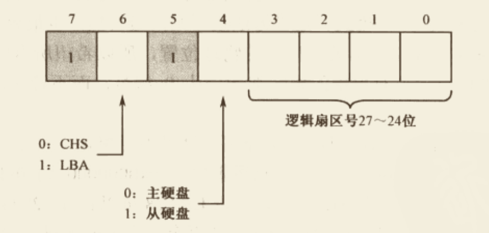
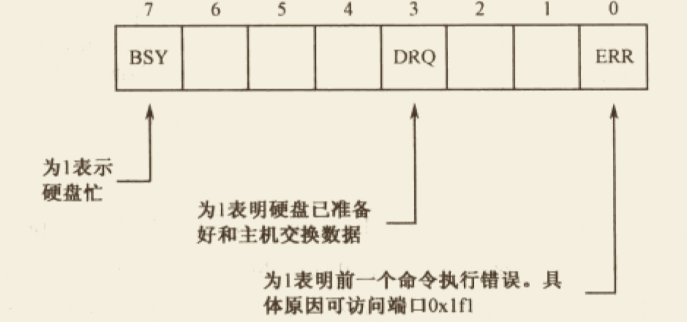

# 硬盘与显卡的访问与控制

>   整理自《x86汇编语言 从实模式到保护模式》`第8章 硬盘与显卡的访问与控制`


## 1. 分段、段的汇编地址和段内汇编地址

处理器的工作模式是将内存分成逻辑上的段，指令的获取与数据的访问一律按照**`段地址:偏移地址`**的方式进行。相对应的，一个规范的程序，应当包括代码段、数据段、附加段和栈段。这样一来，段的划分和段与段之间的界限在程序加载到内存之前就已经准备好了。

`NASM`编译器使用汇编指令**`SECTION`**或**`SEGMENT`**来定义段，它的一般格式是:

```assembly
SECTION 段名称
SEGMENT 段名称
```

+   `NASM`编译器不关心段的用途，可能也根本不知道段的用途

+   一旦定义段，后面的内容就都属于该段，除非又出现了另一个段的定义

    >   有时程序并不以段定义语句开始，在这种情况下，这些内容默认地自成一个段。最典型的是，整个程序中都没有段定义语句，此时这个程序自成一个段。

+   `Intel`处理器要求段的内存中的起始物理地址起码是`16`字节对齐的。并且，`汇编语言源程序中定义的各个段，也有对齐方面的要求`。具体的做法是，在段定义中使用**`align=`**子句，用于指定某个SECTION的汇编地址对齐方式。比如说，**`align=16`**就表示段是16字节对齐的，**`align=32`**就表示段是32字节对齐的。

    +   ```assembly
        section data1 align=16
          db 0x55
          
        section data2 align=16
          db 0xaa
          
        section data3 align=16
          0x99
        ```

        +   如果不考虑段的对齐方式，那么段data1的汇编地址是0，段data2的汇编地址是1，段data3的汇编地址是2 。但是，**`由于每个段定义中都包含了要求16字节对齐的子句，data2的汇编地址是0x10，data3的汇编地址是0x20`**

    +   `每个段都有一个汇编地址，它是相对于整个程序开头（0）的。为了方便取得该段的汇编地址，NASM提供了如下表达式`:

        ```assembly
        section.段名.start
        ```

+   段定义语句还可以包含**`vstart=`**子句。

    +   **如果不包含`vstart=`子句，尽管定义了段，但是引用某个标号时，该标号处的汇编地址依然是从整个程序开头计算的，而不是从段的开头处计算的。**
    +   **如果包含`vstart=`子句，段中定义的标号的汇编地址则是从它所在段的开头计算，而不是从整个程序开头计算。**


## 2. 外围设备及其接口

和处理器打交道的硬件很多，不单单是硬盘，还有显示器、网络设备、扬声器、键盘、鼠标等。所有这些和计算机主机连接的设备，都围绕在主机周围，叫做`外围设备`。这些设备分为两种，一种是输入设备，一种是输出设备，它们也统称**`输入输出设备`**。

输入输出设备与处理器沟通面临两个问题:

+   不可能将所有的I/O接口直接与处理器相连，设备那么多，还有些设备没有发明出来，怎么办？
    +   采用总线技术
+   每个设备的I/O接口都抢着和处理器说话，不发生冲突都难，怎么处理？
    +   使用输入输出控制设备集中器（I/O Controller Hub, ICH）芯片，即`南桥`


### 2.1 I/O端口和端口访问

外围设备和处理器之间的通信是通过相应的I/O接口进行的，具体的说，处理器是通过**`端口（Port）`**来和外围设备打交道的。本质上，**`端口就是一些寄存器，类似于处理器内部的寄存器，不同之处在于，端口寄存器位于I/O接口电路中`**。每一个I/O接口都可能拥有好几个端口，分别用于不同的目的。

**`端口只不过是位于I/O接口上的寄存器，所以，每个端口有自己的数据宽度`**。早期系统中，端口有8位的，也有16位的，之后随着发展，出现了更宽的数据宽度。

端口在不同的计算机系统中有着不同的实现方式。在一些计算机系统中，端口号是映射到内存地址空间的，例如，0x00000~0xE0000是真实的物理内存地址，而0xE0001~0xFFFFF是从很多I/O接口那里映射来的，当访问这部分地址时，实际上是在访问I/O接口。

而在另一些计算机系统中（例如Intel处理器），**`端口是独立编址的，不和内存发生关系`**。在这种计算机中，处理器的地址既连接内存，也连接每一个I/O接口。但是处理器还有一个特殊的引脚`M/IO#`，这里`#`表示低电平有效。也就是说，当处理器访问内存时，它会让`M/IO#`引脚呈高电平，这里，和内存相关的电路就会打开；相反，`M/IO#`呈低电平时，则是访问I/O端口。

在Intel系统中，只允许65535个端口存在。因为是**`独立编址`**，所以端口的访问不能使用`MOV`这样的指令，取而代之的是`in`和`out`指令。

+   `in`指令是从端口读，*`in al, dx`*或`in ax, dx`
    +   也就是说，`in`指令的目的操作数必须是寄存器`al`或`ax`，`in`指令的源操作数必须是寄存器`DX`
    +   `in`指令的源操作数如果不使用寄存器，就必须使用立即数。例如`in al, 0xf0`或`in ax, 0x03`，这种指令形式的源操作数只允许一字节，故只能访问0~255号端口
+   `out`指令格式参考`in`指令


### 2.2 通过硬盘控制器端口读扇区数据

硬盘读写的基本单位是扇区，是典型的块设备。从硬盘读写数据，最经典的方式是向硬盘控制器分别发送磁头号、柱面号和扇区号，称为`CHS`模式。但是实际上，很多时候我们并不关心扇区的物理位置，而是希望所有的扇区都能统一编址，这就是`逻辑扇区`。

最早的逻辑扇区编址方法是**`LBA28`**，使用28个比特来表示逻辑扇区号，每个扇区512字节，所以LBA28可以管理128GB的硬盘。

随着技术发展，又推出了**`LBA48`**，可以管理131072TB的硬盘容量。

个人计算的主硬盘控制器被分配了`8位`端口，端口号从`0x1f0~0x1f7`。要从硬盘读逻辑扇区，过程如下:

+   第一步，设置要读取的扇区数量，数值写入0x1f2端口。这是个8位端口，所以每次最多只能读写255个扇区

    >   ```assembly
    >   mov dx, 0x1f2
    >   mov al, 0x01
    >   out dx, al
    >   ```
    >
    >   +   每读一个扇区，0x1f2中的值就减1，因此如果读写过程中发生错误，该端口包含着尚未读取的扇区数

+   第二步，设置起始LBA扇区号。扇区的读写是连续的，因此只需要给出第一个扇区的编号就可以了。28位扇区号太长，需要将其分成4段，从低到高，分别写入端口0x1f3、0x1f4、0x1f5、0x1f6端口。假设要读写的起始逻辑扇区号为0x02，代码如下:

    >   ```assembly
    >   mov dx, 0x1f3
    >   mov al, 0x02
    >   out dx, al      ;LBA地址7~0
    >   inc dx					;0x1f4
    >   mov al, 0x00
    >   out dx, al      ;LBA地址15~8
    >   inc dx          ;0x1f5
    >   out dx, al.     ;LBA地址13~16
    >   inc dx          ;0x1f6
    >   mov al, 0xe0    ;LBA模式, 主硬盘, 以及LBA地址27~24
    >   out dx, al
    >   ```
    >
    >   +   注: 以上代码最后4行，在现行体系下，每个PATA/SATA接口允许挂接两块硬盘，分别是主盘(Master)和从盘(Slave)。如下所示，高3位是"111"，表示LBA模式:
    >
    >        

+   第三步，向端口0x1f7写入0x20，请求硬盘读。这也是一个8位端口

    >   ```assembly
    >   mov dx, 0x1f7
    >   mov al, 0x20    ;读命令
    >   out dx, al
    >   ```

+   第四步，等待读写操作完成。端口0x1f7既是命令端口，也是状态端口。在通过这个端口发送读写命令之后，硬盘就开始工作，在它内部操作期间，它将0x1f7端口的第7位置"1"，表示自己很忙；一旦硬盘准备就绪，它再将此位清零，说明自己已经忙完了，同时将第3位置"1"，意思是准备好了，请求主机发送或接收数据。代码与示意图如下:

    >   ```assembly
    >   mov dx, 0x1f7
    >   .waits:
    >   in al, dx
    >   and al, 0x88
    >   cmp al, 0x08
    >   jnz .waits     ;不忙, 且硬盘已准备好数据传输
    >   ```
    >
    >   +    

+   第五步，连续取出数据，0x1f0是硬盘接口的数据端口，而且还是一个16位端口。下面代码假定是从硬盘读一个扇区，读取的数据存放到由段寄存器DS指定的数据段，偏移地址由寄存器BX指定:

    >   ```assembly
    >   mov cx, 256
    >   mov dx, 0x1f0
    >   .readw:
    >   in ax, dx
    >   mov [bx], ax
    >   add bx, 2
    >   loop .readw
    >   ```

+   最后，0x1f1端口错误寄存器，包含硬盘驱动器最后一次执行命令后的状态（错误原因）


### 2.3 过程调用

调用过程的指令是**`"call"`**，8086处理器支持四种调用方式：

+   **`16位相对近调用`**，三字节指令，操作码为0xE8，后跟16位的操作数，因为是相对调用，操作数为偏移量

    >   例如**`call 0x0500`**这样的指令，也是相对近调用，编译器依然会用`0x0500`来计算得到一个偏移量，来作为0xE8的操作数

+   **`16位间接绝对近调用`**，这种调用也是近调用，但指令中的操作数不是偏移量，而是被调用过程的真实偏移地址，故称为`绝对地址`。不过这个偏移地址不是直接出现在指令中，而是由16位的通用寄存器或者16位的内存单元间接给出，例如:

    >   ```assembly
    >   call cx					; 目标地址在CX中
    >   call [0x3000]		; 要先访问内存才能取得目标偏移地址
    >   call [bx]
    >   call [bx+si+0x02]
    >   ```

+   **`16位直接绝对远调用`**，属于段间调用，所以叫`远调用`。远调用既需要被调用过程所在段的地址，也需要该过程在段内的偏移地址。`"16"`位是针对偏移地址来说的，而不是限定段地址，尽管段地址事实上也是16位的；`"直接"`的意思是，段地址和偏移地址**`直接`**在`call`指令中给出了。当然，这里的地址也是绝对地址。例如:

    >   ```assembly
    >   call 0x2000:0x0030
    >   ```
    >
    >   +   这条指令编译后的机器码为`9A 30 00 00 20`，`0x9A`是操作码，后面跟着两个字分别是偏移地址和段地址，按规定，**`偏移地址在前，段地址在后`**。
    >   +   call指令在跳转前，会先压栈原代码段地址CS，再压栈指令寄存器IP。被调用过程返回时，需要使用**`retf`**来返回，这样会从栈中依次弹出指令指针寄存器IP和代码段寄存器CS中。

+   **`16位间接绝对远调用`**，例如:

    >   ```assembly
    >   proc_1 dw 0x0102,0x2000
    >   
    >   call far [proc_1]			;从proc_1处取得两个字，其中偏移地址在前，段地址在后
    >   											;所以段地址是0x2000, 偏移地址是0x0102
    >   ```
    >


## 3. 显卡访问

`光标(Cursor)`是在屏幕上有规律地闪动的一条小横线，通常用于指示下一个要显示的字符位置。在基于图形显示的操作系统出现之前，所有软件都在文本模式下工作，而基于硬件的光标只在文本模式下才会出现。

计算机技术发展的很快，很多硬件都已经或者即将淘汰，但显卡是个例外。即使是现在，多年前形成的VGA显示标准在每块显卡中都完好地保留下来了，包括对光标的支持。显示图形的代价太大，在计算机加电启动的时候，以及其它一些根本没必要、也没条件使用图形模式的场合，文本模式是最好的选择。

`光标`在屏幕上的位置保存在显卡内部的两个光标寄存器中，每个寄存器是8位的，合起来形成一个16位的数值。比如，0表示光标在屏幕上第0行第0列，80表示它在第1行第0列，因为标准VGA文本模式是25行，每行80个字符。这样算来，当光标在屏幕右下角时，该值为`25 * 80 - 1 = 1999`。

>   `光标寄存器`是可读可写的，可以从中讲出光标的位置，也可以通过它设置光标的位置。能够通过写入一个数值来设定光标的位置，这不是恩赐，而是责任，因为显卡从来不自动移动光标位置，这个任务是你的。


### 3.1 读取光标位置

显卡操作非常复杂，内部的寄存器也不是一般的多。为了不过多占用主机的I/O空间，很多寄存器只能通过**`索引寄存器`**间接访问。

**`索引寄存器`**的端口号是**`0x3d4`**，可以向它写入一个值，用来指定内部的某个寄存器。比如两个8位的`光标寄存器`，其索引值分别是`14(0x0e)`和`15(0x0f)`，分别用于提供光标位置的高8位和低8位。
指定了寄存器之后，要对它进行读写，这可以通过数据端口`0x3d5`来进行。

