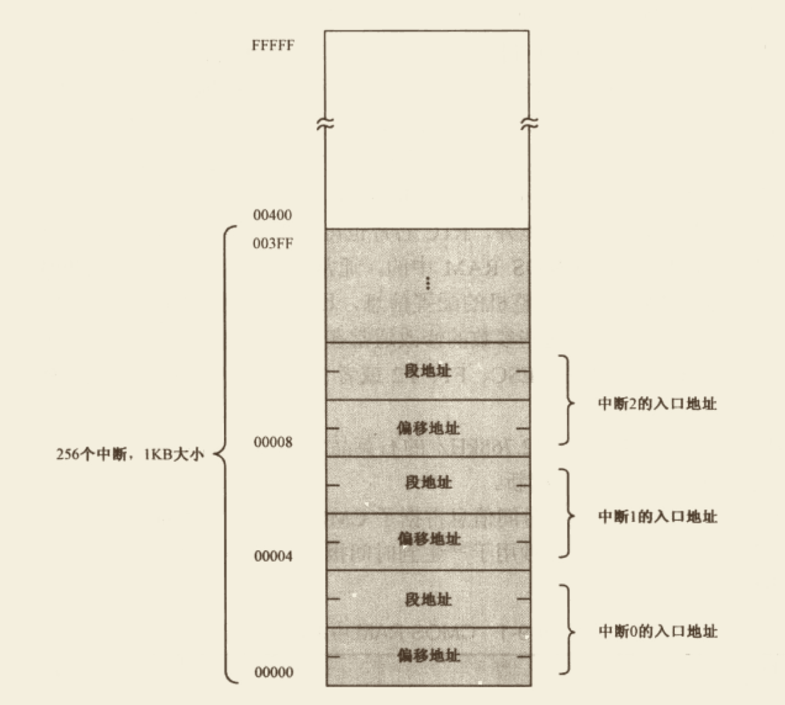

# 中断

>   整理自《x86汇编语言 从实模式到保护模式》第9章


## 1. 外部硬件中断

`外部硬件中断`是通过两个信号线引入处理器内部的，叫做**`NMI`**和**`INTR`**。

来自外部设备的中断很多，但不是每一个中断都是必须处理的。但有些中断，在任何时候都必须及时处理，因为事关整个系统安全性，比如电池电量很低、内存访问电路错误等。

在这种情况下，处理器的设计者希望通过两个引脚来明确区分不同性质的中断。首先，所有的严重事件都必须无条件地加以处理，这种类型的中断是不会被阻断和屏蔽的，称为**`非屏蔽中断(Non Maskable Interrupt, NMI)`**。

与`NMI`不同，更多时候发往处理器的中断信号通常不会意味着灾难，这类中断有两个特点：一是数量多，毕竟有很多外部设备；二是可被屏蔽，这样处理器不会对它们进行处理。所以这类中断称为**`可屏蔽中断`**。`可屏蔽中断`是通过`INTR`引脚进入处理器内部的。

>   处理器每次只能处理一个中断，但是多个设备同时发出中断请求的几率是很高的，此时就需要一个代理，来接受外部设备发出的中断号，并对它们进行仲裁，以决定让它们中的哪一个优先向处理器提出服务请求。在个人计算机中，用的最多的中断代理是**`8259`**芯片，即通常所说的**`中断控制器`**。
>
>   Intel处理器允许256个中断，中断号范围是`0~255`，`8259`负责提供其中的15个，但中断号并不固定。原因是当初设计的时候，允许软件根据自己的需要灵活设置中断号，以防止发生冲突。`8259`芯片有自己端口号，可以像访问其它外部设备一样用in和out指令来改变它的状态，包括各引脚的中断号，所以`8259`也叫`可编程中断控制器(Programmable Interrupt Controller, PID)`。
>
>   +   8259具体的编程方式这里就不贴了

当一个中断发生时，处理器将会通过中断引脚NMI和INTR得到通知。除此之外，它还应当知道发生了什么事，以便采取适当的处理措施。**`每种类型的中断都被统一编号，这称为中断类型号、中断向量或者中断号`**。但是，由于不可屏蔽中断的特殊性--几乎所有触发NMI的事件对处理器来说都是致命的，甚至是不可纠正的，在这种情况下了解中断原因没有太大意义，所以**`在实模式下，NMI被赋予了统一的中断号2，不再进行细分`**。


### 1.1 实模式下的中断向量表

`中断处理`就是处理器要执行一段与该中断有关的程序（指令）。处理器可以识别256个中断号，理论上就需要256段程序。这些程序的位置并不重要，重要的是，**`在实模式下，处理器要求将它们的入口点集中存放到内存从物理地址"0x00000"开始，到"0x003ff"结束，共1KB的空间内，这就是所谓的"中断向量表"(Interrupt Vector Table, IVT)`**。

如下图所示，每个中断在中断向量表中占2个字，分别是中断处理程序的偏移地址和段地址：




当中断发生时，如果从外部硬件到处理器之间的道路都是畅通的，处理器在执行完当前指令后，会立即着手为硬件服务。它首先会响应中断，告诉`8259`芯片准备处理该中断。接着，它还会要求`8259`芯片把中断号送过来。

中断信号来自哪个引脚，`8259`芯片最清楚，它会将对应的中断号告诉处理器。处理器拿到这个中断信号，要顺序做如下几件事:

+   **`保护断点的现场`**。首先将`EFLAGS`压栈，然后清除它的IF位和TF位。接着再将当前的代码段寄存器CS和指令指针寄存器IP压栈。

+   **`执行中断处理程序`**。处理器已经拿到中断号，它将该号码乘以4，就得到该中段入口点在中断向量表中的偏移地址。接着，从表中依次取现中断程序的偏移地址和段地址，并分别传送至IP和CS，处理器开始执行中断处理程序。

    >   注：由于`IF`标志被清除，在中断处理程序中，处理器将不再响应硬件中断。如果希望更高优先级的中断嵌套，可以在编写中断处理程序时，适时用`sti`指令开放中断。

+   **`返回到断点接着执行`**。所有中断处理程序的最后一条指令必须是中断返回指令**`iret`**。这将导致处理器依次从栈中弹出（恢复）IP、CS和EFLAGS的原始内容，于是转到主程序继续执行。

+   **`注：和可屏蔽中断不同，NMI发生时，处理器不会从外部获得中断号，它自动生成中断号码2，其它处理过程和可屏蔽中断相同`**。

    >   中断随时会发生，中断向量表的建立和初始化工作是由BIOS在计算机启动时负责完成的。BIOS为每个中断号填写入口地址，因为它不知道多数中断处理程序的位置，所以，一律将它们指向一个相同的入口地址，在那里，只有一条指令:**`iret`**。当计算机启动后，操作系统和用户程序再根据自己的需要，来修改某些中断的入口地址，使它指向自己的代码。


## 2. 内部中断

和硬件中断不同，内部中断发生在处理器内部，是由执行的指令引起的。比如，当处理器检测到div或者idiv指令的除数为0时，或者除法的结果溢出时，将产生中断0（0号中断），这就是除法错中断。再比如，处理器遇到非法指令时，将产生中断6。

*`"内部中断"不受标志寄存器IF位的影响，不需要中断识别总线周期，它们的中断类型是固定的，可以立即转入相应的处理过程`*。


## 3. 软中断

`软中断`由**`int`**指令引起的中断处理。这类中断也不需要中断识别总线周期，中断号在指令中给出。


### 3.1 BIOS中断

可以为所有的中断类型自定义中断处理过程，包括内部中断、硬件中断和软中断。

编写自己的中断处理程序有相当大的优越之处，不像jmp或call指令，**`int`指令不需要知道目标程序的入口地址**。举个例子来说，如果想读硬盘上的一个文件，操作系统已经有这样的功能，那么就直接调用操作系统的例程就可以了，但是操作系统不会公布自己硬盘读写的段地址和偏移地址，因为操作系统也是经常修改/更新的，这样一来，入口地址也会发生变化。

因为有了软中断，这是个利好条件，每次操作系统加载完自己之后，以中断处理程序的形式操作硬盘读写功能，并把该例程的地址填写到中断向量表中，这样，无论什么时候用户程序需要该功能时，直接发出一个软中断即可，不需要知道具体地址。

最有名的软件中断是`BIOS中断`，因为它们是在计算加电、BIOS程序执行期间建立起来的，又称`BIOS调用`。主要是为了方便地使用最基本的硬件访问功能。不同的硬件使用不同的中断号，比如使用键盘时，中断号是0x16。

通常，为了区分针对同一硬件的不同功能，使用寄存器`AH`来指定具体的功能编号。举例来说，以下指令用于从键盘读取一个按键:

```assembly
mov ah, 0x00		;从键盘读字符
int 0x16				;键盘服务.返回时,字符代码在寄存器AL中
```


#### 3.1.1 BIOS中断建立

BIOS是如何建立起这套功能调用中断的？它又是怎么知道如何访问硬件的？毕竟，即使是它，要访问硬件也得通过端口一级的途径。

答案是，BIOS可能会为一些简单的外围设备提供初始化代码和功能调用代码，并填写中断向量表，但也有一些BIOS中断是由外部设备接口自己建立。

>   首先，每个外部设备接口，包括网卡、显卡等，都有自己的`只读存储器(Read Only Memory, ROM)`，这些ROM中提供了它自己的功能调用例程，以及本设备的初始化代码。按照规范，前两个单元的内容是0x55和0xAA，第三个单元是本ROM中以512字节为单位的代码长度；从第四个单元开始，就是实际的ROM代码。
>
>   其次，从内存物理地址A0000开始，到FFFFF结束，有相当一部分空间是留给外围设备的。如果设备存在，那么它自带的ROM会映射到分配给它的地址范围内。
>
>   在计算机启动期间，BIOS程序会以2KB为单位搜索内存地址C0000~E0000之间的区域。当它发现某个区域的头两个字节是0x55和0xAA时，那意味着该区域有ROM代码存在，是有效的。接着，它对该区域做累加和检查，看结果是否和第三个单元相符，如果相符，就从第四个单元进入。这时，处理器执行的是硬件自带的程序指令，这些指令初始化外部设备的相关寄存器和工作状态，最后，`填写相关的中断向量表，使它们指向自带的中断处理过程`。


### 3.2 从键盘读字符并显示

